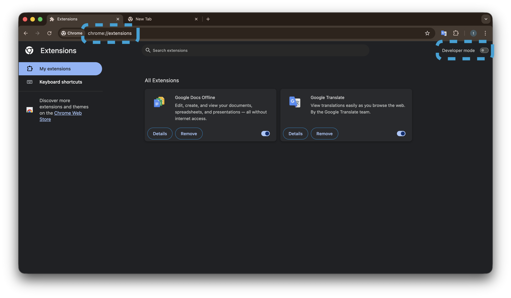
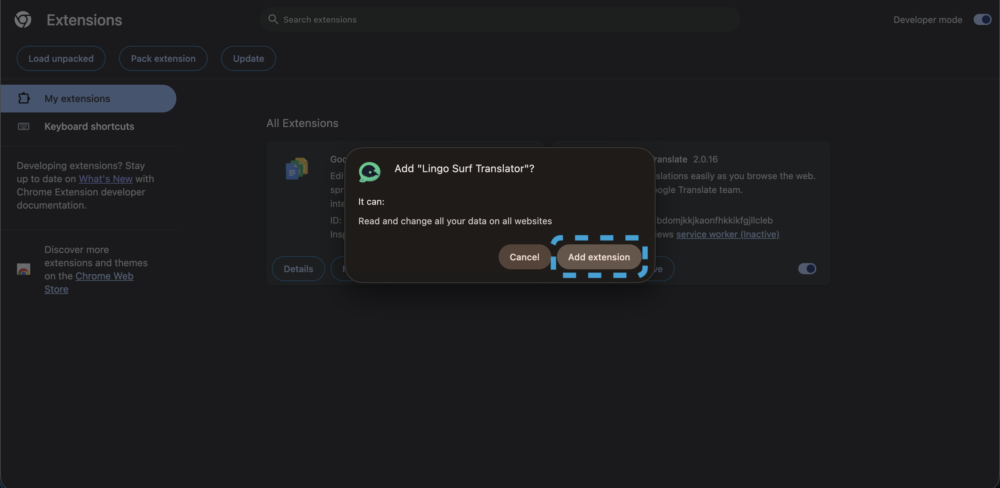
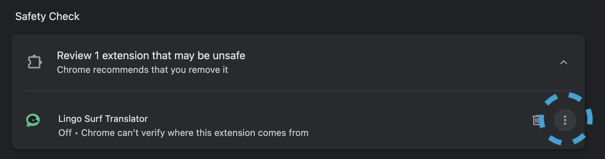
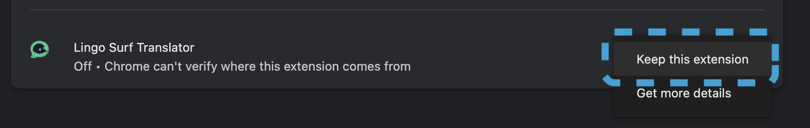

# In## Quick Download

[Download Extension (.crx)](https://github.com/AatreyuShau/lingo-surf/raw/main/chrome-extension.crx)

or direct link:
```
https://github.com/AatreyuShau/lingo-surf/raw/main/chrome-extension.crx
```ation Guide

This guide will walk you through the process of installing Lingo Surf.

## Quick Download

<a href="https://raw.githubusercontent.com/AatreyuShau/lingo-surf/main/chrome-extension.crx" download>
    Download Extension (.crx)
</a>

## Step-by-Step Installation after downloading the .crx file

### Step 1: Open Chrome Extensions Page


- Open Google Chrome
- Type `chrome://extensions/` in the address bar
- Or navigate through: Menu (⋮) → More Tools → Extensions

  **Enable Developer Mode**
- Look for the "Developer mode" toggle in the top-right corner
- Switch it on
- You'll see new options appear at the top of the page

### Step 2: Load the Extension


- Click the "Load unpacked" button
- Navigate to the `chrome-extension` folder inside the downloaded/cloned repository
- Select the folder (don't go inside it, just select the folder itself)
- Click "Select Folder" (macOS) or "Select" (Windows)

### Step 3: Verify Installation




- You should see "Lingo Surf" appear in your extensions list
- The extension icon should appear in your Chrome toolbar
- If you don't see the icon, click the puzzle piece icon to find it
- Pin it to your toolbar for easy access

## Troubleshooting

If you encounter any issues:

1. **Extension not appearing?**
   - Make sure you selected the correct folder
   - Verify that manifest.json is directly inside the selected folder

2. **Getting errors?**
   - Check the error message in the extensions page
   - Verify all files are present in the chrome-extension folder
   - Try reloading the extension

3. **Icon not visible?**
   - Click the puzzle piece icon in the Chrome toolbar
   - Find "Lingo Surf" in the dropdown
   - Click the pin icon to keep it visible

## Updating the Extension

To update the extension after pulling new changes:

1. Go back to `chrome://extensions/`
2. Find Lingo Surf in the list
3. Click the refresh icon
4. Or simply click "Update" if you see the update button