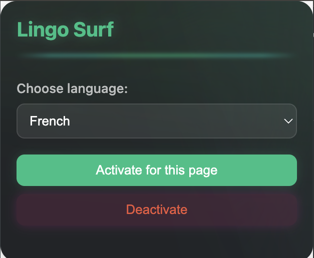

#  Lingo Surf 🥝

[](https://github.com/AatreyuShau/lingo-surf/blob/main/LICENSE)


A sleek Chrome extension for seamless language learning while you surf the web. Translate words on any webpage with a beautiful, modern interface.

<p align="center">
  
</p>

## Features

- Support for 100+ languages
- Modern, dark theme interface with dynamic animations
- Remembers your last selected language
- Works on any webpage
- Fast and lightweight
- Simple single click activation

## Installation

   - Download the `.crx` file
    >> <a href="https://github.com/AatreyuShau/lingo-surf/blob/main/chrome-extension.crx" download>
        Download Extension (.crx)
    </a>
   - Open Chrome and go to `chrome://extensions`
   - Turn on `Developer Mode`
   - Drag the `.crx` file in
   - click the ` ⠇ ` and press *`Keep this Extension`*

 > For a more detailed guide check the 

 ## Alternative Installation

   - Download the `.zip` file
    >> <a href="https://github.com/AatreyuShau/lingo-surf/blob/main/chrome-extension.zip" download>
        Download Extension (.zip)
    </a>
   - Expand the `.zip` file in your file-explorer
   - Open Chrome and go to `chrome://extensions`
   - Turn on `Developer Mode`
   - Drag the `.zip` file in

## How to Use

1. Click the Lingo Surf icon in your Chrome toolbar
2. Select your target language from the dropdown
3. Click "Activate for this page"
4. Hover over words to see translations
5. Click "Deactivate" when you're done

## Development

```bash
# Clone the repository
git clone https://github.com/AatreyuShau/lingo-surf.git

# Navigate to the extension directory
cd lingo-surf/chrome-extension

# Install dependencies (if any)
npm install
```

## Contributing

Contributions are welcome! Feel free to:
- Report bugs
- Suggest new features
- Submit pull requests

## License

This project is licensed under the GNU GPLv3.0 License; see the [LICENSE](LICENSE) file for details.

---

<p align="center">
    Woven from words, code, & pure happenstance :]
</p>

---